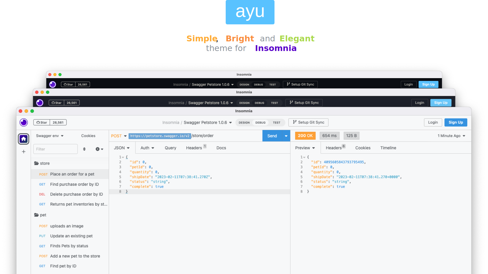

## Installation

- Go to Insomnia Settings > Plugins
- Type `insomnia-plugin-theme-ayu` and install the plugin

## Activating theme

1. Go to Application and select **Preferences**
2. Click on **Themes**
3. Select Ayu theme *(Light, Dark or Mirage)* to apply it

## Contributing

Found any bugs? Have any more ideas or want to contribute to the existing development? Feel free to create a PR/issue in the GitHub repo!